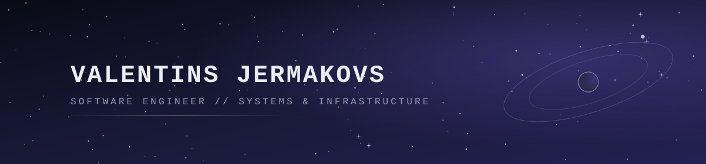

  

  

  <i>"Somewhere, something incredible is waiting to be known." — Carl Sagan</i>

---

# About Me

Developer who enjoys building things and figuring out how they work.

- Interested in software architecture & backend development
- Experimenting with different technologies and self-hosted infrastructure
- Curious about databases & data modeling
- Working with local AI models (self-hosted LLMs, running inference on my own hardware)
- Building projects to learn by doing
- Always exploring better ways to solve problems

**Build. Break. Learn. Improve. Repeat.**

---

# Tech Stack

**Languages**

  

**Frontend**

     

**Backend**

**Databases**

    

**Tools & Environment**

 

---

# Self-Hosting & Local AI

Running my own infrastructure at home, including local LLM inference and self-managed storage/services.

- **OpenMediaVault** — home server & NAS management
- **Local LLMs** — running and experimenting with self-hosted AI models
- **Ubuntu** — primary OS environments for development and server workloads

---

# Beyond Code

Astronomy, sci-fi, and a long-standing appreciation for ThinkPads.

---
